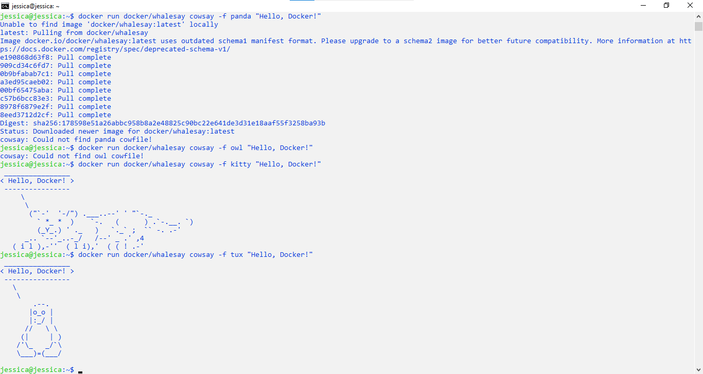
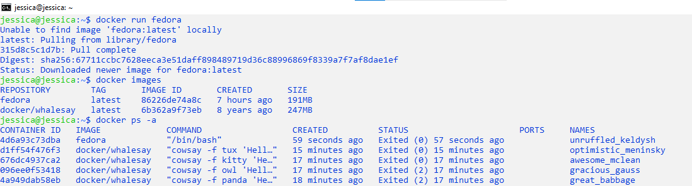
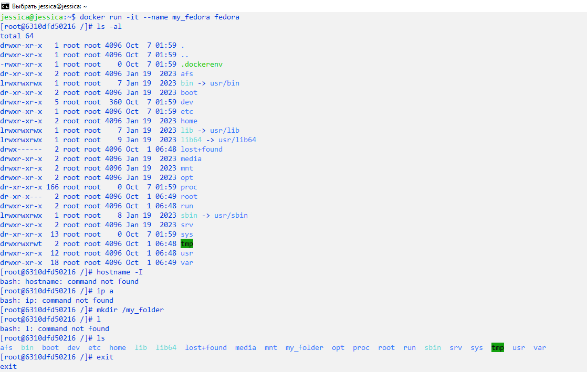
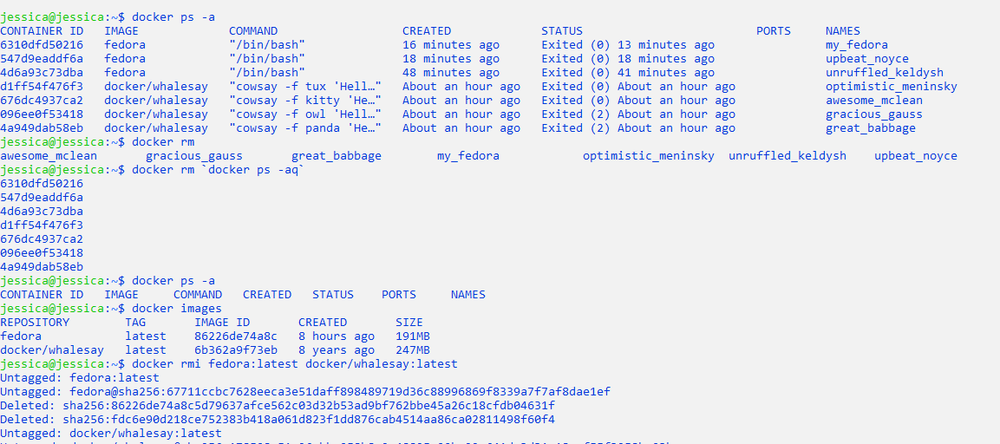
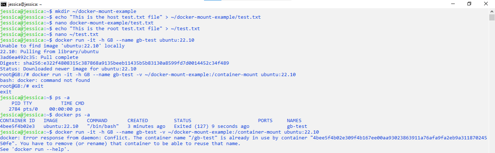
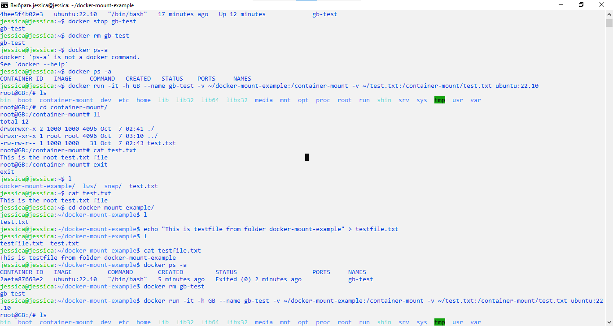
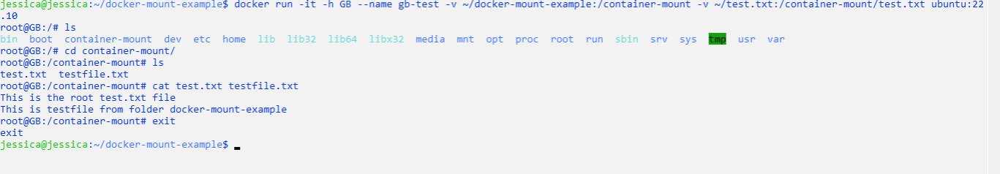

# Containerization. Workshop 3. Homework. Тогочакова Евгения. 4544
# Введение в Docker 
## Задание 2: первые шаги в использовании Docker
Делаем первые шаги в использовании Docker c использованием образа "docker/whalesay". Запустим контейнер с рисунком панды, совы, кота и пингвина.
```
jessica@jessica:~$ docker run docker/whalesay cowsay -f panda "Hello, Docker!"  
jessica@jessica:~$ docker run docker/whalesay cowsay -f owl "Hello, Docker!"
jessica@jessica:~$ docker run docker/whalesay cowsay -f kitty "Hello, Docker!"
jessica@jessica:~$ docker run docker/whalesay cowsay -f tux "Hello, Docker!" 
```


## Задание 3: тестируем основные команды
Создадим контейнер, запустим его, посмотрим, что внутри, удалим этот контейнер, удалим все существующие образы. 
```
jessica@jessica:~$ docker run fedora 
jessica@jessica:~$ docker images
jessica@jessica:~$ docker ps -a

```


```
docker run -it --name my_fedora fedora 
[root@6310dfd50216 /]# ls -al
[root@6310dfd50216 /]# mkdir /my_folder
[root@6310dfd50216 /]# ls 
[root@6310dfd50216 /]# exit
```


```
jessica@jessica:~$ docker ps -a 
jessica@jessica:~$ docker rm `docker ps -aq`
jessica@jessica:~$ docker ps -a
jessica@jessica:~$ docker images
jessica@jessica:~$ docker rmi fedora:latest docker/whalesay:latest
jessica@jessica:~$ docker images
```


## Задание 4: хранение данных в контейнерах docker
```
jessica@jessica:~$ mkdir ~/docker-mount-example
jessica@jessica:~$ echo "This is the host test.txt file" > ~/docker-mount-example/test.txt 
jessica@jessica:~$ nano docker-mount-example/test.txt 
jessica@jessica:~$ echo "This is the root test.txt file" > ~/test.txt
jessica@jessica:~$ nano ~/test.txt 
jessica@jessica:~$ docker run -it -h GB --name gb-test ubuntu:22.10
```
Смонтируем ранее созданную папку с хоста в контейнер:
```
jessica@jessica:~$ docker run -it -h GB --name gb-test -v ~/docker-mount-example:/container-mount ubuntu:22.10
```


Смонтируем созданный ранее текстовый файл из домашней директории внутрь смонтированной папки в контейнере:

```
jessica@jessica:~$ docker run -it -h GB --name gb-test -v ~/docker-mount-example:/container-mount -v ~/test.txt:/container-mount/test.txt ubuntu:22.10
```


Выводы:1)монтировать все директории лучше всего сразу при запуске контейнера, иначе потом 
         из-за "дополнительного монтирования" придется удалять остановившийся контейнер и снова запускать новый;
       2)названия файлов в монтируемых директориях должны отличаться, иначе будет "конкуренция" и "перезапись";
       3)если отдельно примонтирован какой-то файл, он будет "перезаписывать" файл с аналогичным названием 
       из другой монтируемой директории